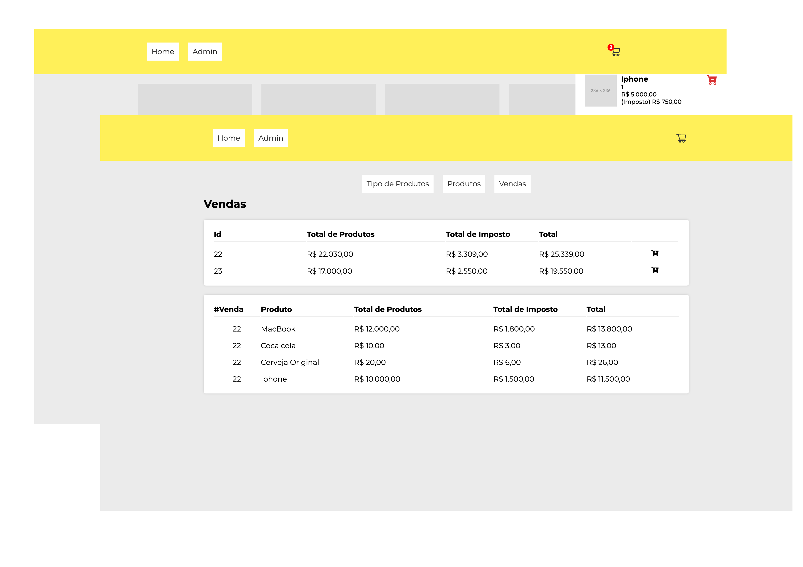

<h1 align="center">
    Loja PHP + React
</h1>

<p align="center">

  
  
  <a href="https://github.com/yhanndaniel/mercado-php-react/commits/master">
    
  </a>

  <a href="https://github.com/yhanndaniel/mercado-php-react/issues">
    
  </a>

  
</p>

<p align="center">
  <a href="#rocket-tecnologias">Tecnologias</a>&nbsp;&nbsp;&nbsp;|&nbsp;&nbsp;&nbsp;
  <a href="#-projeto">Projeto</a>&nbsp;&nbsp;&nbsp;|&nbsp;&nbsp;&nbsp;  
</p>

<br>

<p align="center">
  
</p>

## :rocket: Tecnologias

Esse projeto foi desenvolvido com as seguintes tecnologias:

- [PHP](https://www.php.net/)
- [React](https://react.dev/)
- [PostgreSQL](https://www.postgresql.org/)

## 💻 Projeto

Um MVP de Loja Feita com PHP puro + React.
Para Rodar o Projeto é necessário rodar os seguintes comandos:

```
composer install
```

```
php -S localhost:8080 -t public
```